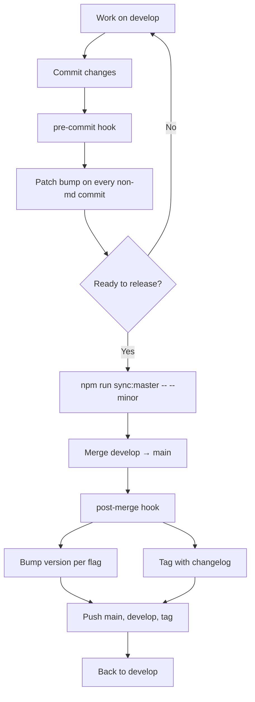

# Scripts

Utility scripts for managing the git-flow workflow of this repo.

## Available Scripts

### `install-hooks.mjs`

Installs the Git hooks from `.githooks/` into `.git/hooks/`.

**Usage:**

```bash
npm run hooks:install
```

**When it runs:**

- Automatically during `npm install` (`prepare` script)
- Manually when hooks need reinstalling

See [`../.githooks/README.md`](../.githooks/README.md) for detail on what each hook does.

---

### `uninstall-hooks.mjs`

Removes the installed Git hooks.

**Usage:**

```bash
npm run hooks:uninstall
```

Useful for debugging or disabling the automatic version bump.

---

### `sync-master.mjs`

Releases `develop` into `main` with an automatic version bump + tag.

**Usage:**

```bash
npm run sync:master              # default: minor bump + tag
npm run sync:master -- --patch   # patch bump (X.Y.Z+1)
npm run sync:master -- --minor   # minor bump (X.Y+1.0)
npm run sync:master -- --major   # major bump (X+1.0.0)
npm run sync:master -- --no-tag  # merge without bumping or tagging
```

**Steps:**

1. Verifies you're on `develop` with a clean tree
2. Pushes `develop` to `origin`
3. Switches to `main` and merges `develop` (auto-resolves `package.json` conflicts in favor of `develop`)
4. `post-merge` hook bumps version, commits, and tags (controlled by `VERSION_BUMP_TYPE` env)
5. Pushes `main`, `develop`, and the new tag
6. Returns to `develop`
7. Verifies `develop` and `main` are at the same version

**Requirements:**

- Must be on `develop`
- No uncommitted changes
- Git hooks installed (`npm run hooks:install`)

## Workflow



## Development

Scripts are ES modules (`.mjs`) using only Node built-ins for portability.

```bash
node scripts/install-hooks.mjs
node scripts/uninstall-hooks.mjs
node scripts/sync-master.mjs --patch
```

---

**See also:**

- [Project README](../README.md)
- [Git Hooks README](../.githooks/README.md)
